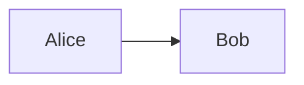
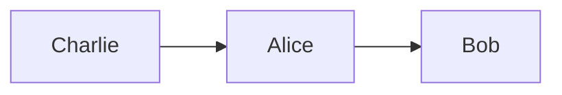
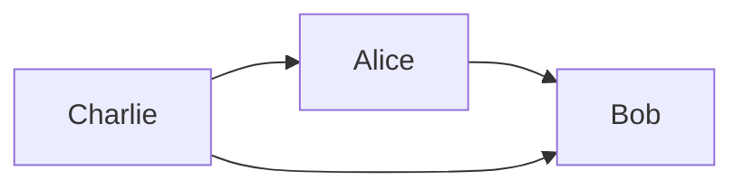
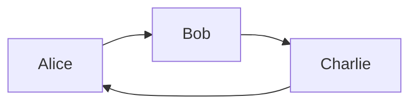

# Tideman
[Problem Sets](./CS50x_Problem-Sets.md)

A tideman election defines who is the prefered candidate if the election was between only two candidates, by considering each pair of candidates one at a time

| Ballot | Ballot | Ballot | Ballot | Ballot |
|--------| ------ | ------ | ------ |------- |
| Alice  | Charlie| Bob    | Bob    | Charlie|
| Charlie| Alice  | Charlie| Alice  | Alice  |
| Bob    | Bob    | Alice  | Charlie| Bob    |

## Ranked Pairs

If this election was between Alice and Bob only, Alice would have won

| Ballot | Ballot | Ballot | Ballot | Ballot |
|--------| ------ | ------ | ------ |------- |
| Alice  |        | Bob    | Bob    |        |
|        | Alice  |        | Alice  | Alice  |
| Bob    | Bob    | Alice  |        | Bob    |

3 out of 5 votes prefer Alice over Bob  
This is represented in a graph with an arrow from Alice to Bob

If the election was between Alice and Charlie, Charlie would have won

| Ballot | Ballot | Ballot | Ballot | Ballot |
|--------| ------ | ------ | ------ |------- |
| Alice  | Charlie|        |        | Charlie|
| Charlie| Alice  | Charlie| Alice  | Alice  |
|        |        | Alice  | Charlie|        |

3 out of 5 voters prefer Charlie over Alice

If the election was between Charlie and Bob, Charlie would have won

| Ballot | Ballot | Ballot | Ballot | Ballot |
|--------| ------ | ------ | ------ |------- |
|        | Charlie| Bob    | Bob    | Charlie|
| Charlie|        | Charlie|        |        |
| Bob    | Bob    |        | Charlie| Bob    |

3 out of 5 voters prefer Charlie over Bob

Since Charlie has no arrows pointing to him and has arrows pointing to others he is considered the *source* of the graph, he is the candidate who would have won on any head to head election

### Cycles
With such system a situation where there's no candidate who would win in every head to head match could appear

| Ballot | Ballot | Ballot | Ballot | Ballot | Ballot | Ballot | Ballot | Ballot |
|--------| ------ | ------ | ------ |------- | ------ |------- | ------ |------- |
| Alice  | Alice  | Alice  | Bob    | Bob    | Charlie| Charlie| Charlie| Charlie|
| Bob    | Bob    | Bob    | Charlie| Charlie| Alice  | Alice  | Alice  | Alice  |
| Charlie| Charlie| Charlie| Alice  | Alice  | Bob    | Bob    | Bob    | Bob    |

In this case Alice is prefered over Bob, who is prefered over Chalier, who is prefered over Alice

The graph has no source so it isn't impossible to define a winner

To solve this we must get the strength of each victory and sort them, unless it creates a cycle
Alice --> Bob, 7-2
Charlie --> Alice, 6-3

Bob would beat Charlie by 5-4, but that would create a cycle, so we skip Bob. All pairs were considered and the election is over

Charlie is the winner

## Files
### `tideman.c`
- array `preferences[i][j]`
    - Defines number of people who prefer candidate `i` over candidate `j`
        - `preferences[Alice Index][Bob Index] = 2`: 2 people prefer Alice over Bob

- array `locked[i][j]`
    - Defines that candidate `i` wins over candidate `j`
        -   `locked[Alice Index][Bob Index] = true`: Alice wins over Bob
        - It's equivalent to the arrows in the graph. We should only lock a pair (create a arrow) if doing so won't create a cycle

- struct `pair`
    - stores the index of the winner and loser candidate of each possible pair

- array `candidates`
    - Stores the name of each candidate, others arrays reference the candidates by the index in this array

- array `pairs`
    - Represent each possible pair of candidates
        - Each index has a struct `pairs` with winner and loser fields

- `pair_count`
    - Number of possible pairs

- `candidate_count`
    - Amount of candidates

- function `main`
    - Loops through ever index in `locked` and sets them all to false
    - Gets all preferences from voters and store in an array `ranks[i]` by calling function `vote`
        - `i` is the rank number 
        - The value stored is the index of the voted candidate

    - Pass `ranks` to `record_preferences`, which updates the `preferences` array
    - Calls `add_pairs`, which add each possible pair of candidates to the `pairs` array
    - Calls `sort_pairs` to sort the `pairs` array
    - Calls `lock_pairs`, which locks each pair of candidates (add "arrows in the graph") 
    - Calls `print_winner` which prints the elections winner

## TODOS
- [x] `vote` function
    - Function takes `rank`, `name` and `ranks` as arguments
        - [x] Check if candidate exists
        - [x] Update `ranks` array at the `rank` index with the index of the candidate
        - [x] Return `true` if candidate exists, `false` otherwise

- [x] `record_preferences` function
    - Function is called for each voter and takes the `ranks` array as argument
        - [x] Update `preferences` array to add the current voters preferences

- [x] `add_pairs` function
    - [x] Add all pairs of candidates where one candidate is prefered over the other to the `pairs` array
        - Do not include ties
- [x] `sort_pairs` function
    - [x] sort the `pairs` array in decreasing order of strength of victory

- [ ] `lock_pairs` function
    - [ ] Create the graph, locking each pair as long it doesn't creates a cycle

- [ ] `print_winner` function

