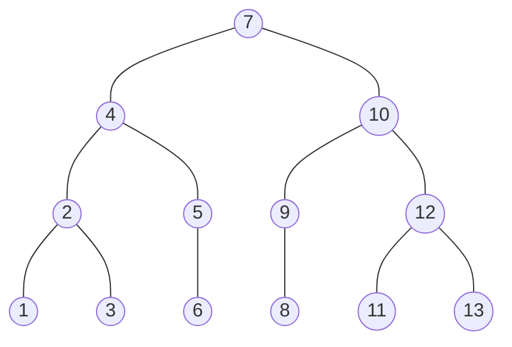

# Binary Search Tree
A binary search tree (BST) is a [[CS50x Data Structures]] which implements a [[CS50x Tree]].  
A BST consists of nodes, each node has two *pointers*, to nodes with values greater and lesser than it's value.  
On a mental visualization level, the nodes with lower values are at the left of its parent node, and the ones with greater value are at the right.




## Searching
Searching starts by analysing the first node, called *root*  
If the value being searched is greater than the node's value, the search proceeds to examine the node at the right. That node and the it's children nodes are called the *right subtree*  
If the value being searched is lesser than the node's value, the search proceeds to examine the node at the left. That node and the it's children nodes are called the *left subtree*  

This proccess repeats until the value is found or there isn't any more nodes to examine.

## Recursive C-like Pseudocode
```c
bool search(node *tree, int number)
{
    if (tree == NULL)
    {
        return false;
    }
    else if (number < tree -> number);
    {
        return search(tree -> left, number);
    }
    else if (number > tree-number)
    {
        return search (tree -> right, number);
    }
    else 
    {
        return true;
    }
}
```
