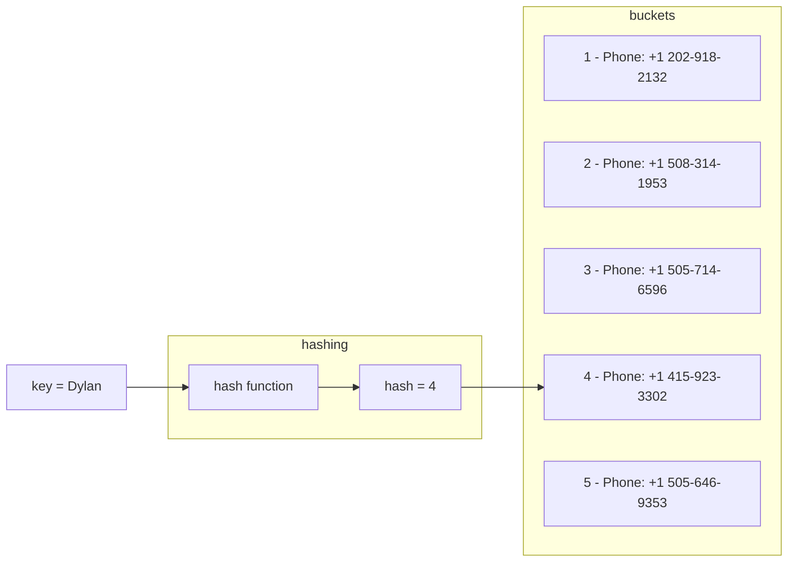
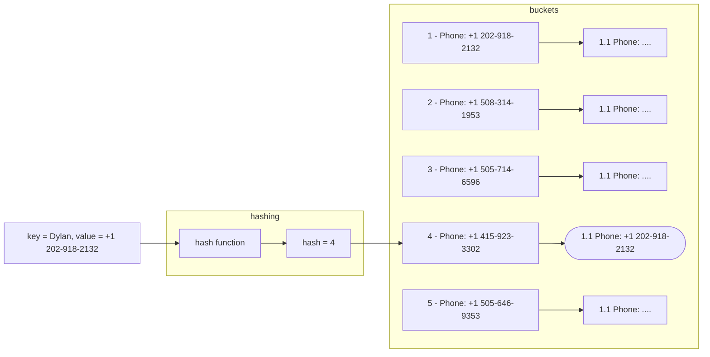
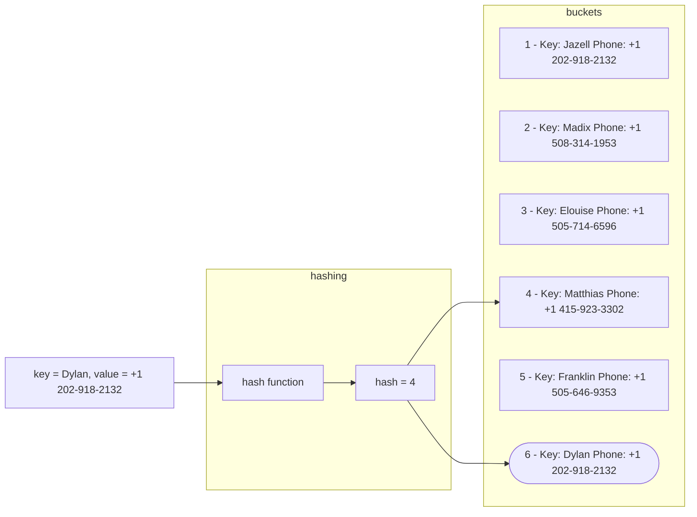

# Hash Table
A hash table is a data structure which implements an [[CS50x Associative Arrays]], by mapping *keys* to *values*, indexing them with a [[CS50x Hash Function]]

## Structure
A hash table consists of an arrays of *values*, commonly called *buckets*, each one stored in an specific index of that array. The index used to store that value is calculated by it's correspondent *key*.

### Inserting
Insertion works by giving the key to a *hash function*, which will compute an *index*, also called a *hash code*. That index is then used to store the value in the array.

### Searching
Searching works the same way as inserting. The key must be given to the hash function, which will return the index where the corresponding value for that key is stored.

## Collisions
Collisions happen when two different keys compute to the same index. Ideally every key will compute to an unique index, but most hash tables implement an *imperfect* hash function, which causes collisions. 

Collisions can be solved with two methods: 

### Separate Chaining

Separate chaining consists of transforming the *buckets* array into a [[CS50x Linked Lists]], with three fields:

- Key: The key used to search for this node
- Value: The value that must be retrieved
- Reference: A pointer to the next node, followed in case of collision.

When searching the hash table, the first node corresponding to that key will be retrieved. The program should then check that the key given to the hash function matches the one in the node. If it does not the program follows the pointer to the next node.  

This adds time complexity and increases the use of memory, but if the hash function is implemented properly most keys will have unique indexes associated to it.

### Open Adressing
Open addressing records the keys and values in the buckets array itself. If a value has to be inserted in an already occupied slot, then the next free slot is selected.  
When searching for a value, the program checks if the key given to the hash function matches the key stored in the array, if it does not the it checks the next index, until it finds the corresponding valur or an empty slot (which means an unsuccesful search).

## Time Complexity
A hash table's time complexity depends heavily on how the hash function is implemented.
It's time's complexity ranges from $O(n)$ (*Linear Time*) to $O(1)$ *Constant Time*
