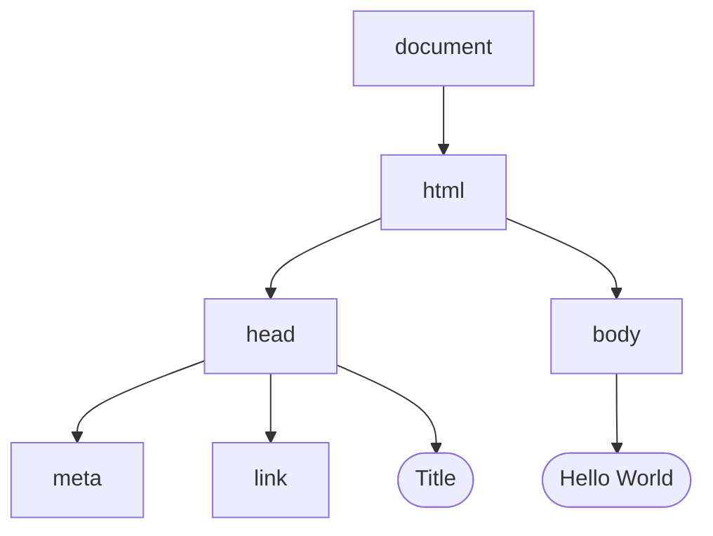

# HTML DOM
DOM (Document Object Model) is the structure of HTML files, where each tag is a node, tags inside tags are children and text inside those tags are objects

## Example
```html
<!DOCTYPE html>
<html lang="en">
    <head>
        <title>Title</title>
        <meta charset="UTF-8">
        <meta name="viewport" content="width=device-width, initial-scale=1">
        <link href="css/style.css" rel="stylesheet">
    </head>
    <body>
        <h1> Hello, World </h1>
    </body>
</html>
```

The below codeblock can be represented with a tree


