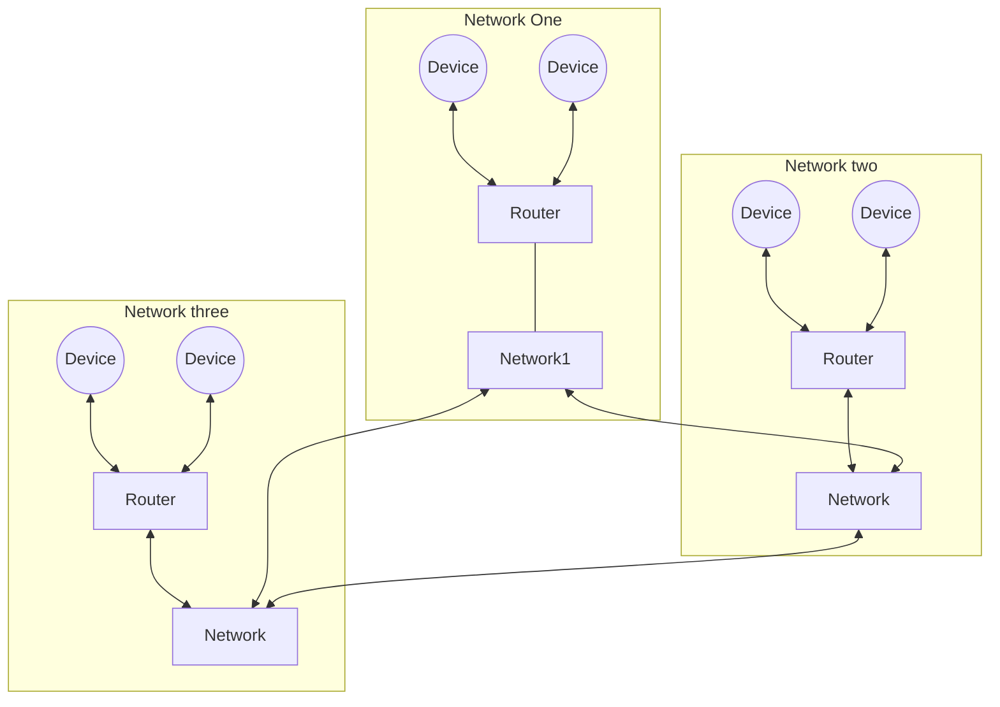

# Local Networks
Devices don't connect directly to each other. Local Networks do this job, acting as an intermediary between devices.  
A local network is a combination of routers, ISPs (Internet Service Providers), DNSs, DHCPs on a local level.  
These networks connect between themselvs so none of them has to know the IP addresses of every device and server in the world. Instead they only need to know what network has that information  

Every device can connect to each other through their networks
