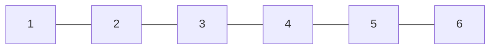

# Arrays
An array is a [Data Structure](../Week-5-Data-Structures/CS50x_Data-Structures.md) consisting of elements stored in sequence in memory.



## As Data Structures
As a data structure, an array is a sequence of elements stored sequentially in memory, where each element can be acessed through the following formula:
`
address = (base address) + (element index * size of a single element)
`
Where base address is the address of the first element in the array.  
Arrays are used to implement many others data structures, like [Strings](./CS50x_Strings.md) and lists.

## As a Data Type
Arrays are implemented as data type in some languages, but that does not mean this type uses an array *data structure on memory level*. The data type may be an implementation of another data structure like *linked lists*, *hash tables*, etc...

In C arrays are described as [Derived Data Types](./CS50x_Derived-Data-Types.md)
Its type is the same of the value's type stored inside it.

## Declaring and accessing arrays
An array is declared using *[]* after the variable's name, followed by its elements between *{}*
To access its values you have to specify the value's position **starting on 0**.

### Example
```C
#include <stdio.h>

int main(void){
    int integer_array[] = {1, 2};
    printf("%d\n", integer_array[1]);
}
```
**output**
> 2
> this is an array

#### Explaining Example
1. an array of integers is declared, with 2 values, 1 and 2
2. print the value at position 1 in the integer_array. That prints 2.
