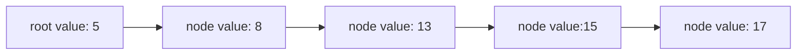

# Linked Lists
A linked lists is a data structure that stores a collection of elements, linking one to the next. In memory, a linked list isn't stored sequentially, like an array. Instead, every *node* in a linked list has a *pointer* to the next node.

## Types of Linked Lists
There are multiple types of linked lists:
- [Singly Linked Lists](./CS50x_Singly-Linked-Lists.md): Linked lists that each node has only a single pointer, pointing to the next element in the list.
- [Doubly Linked Lists](./CS50x_Doubly-Linked-Lists.md): Linked lists that each node has two pointers, pointing to the previous and next element in the list.

## Use
Lists are a simple data structure that can be used to implement many *Abstract Data Types*, like [Stack](./CS50x_Stack.md) and [Queue](./CS50x_Queue.md)

## Pros and Cons
A linked list can have values added to it without having to worry about enough memory being allocated in advance, unlike arrays, which must be reallocated to store more values than it size allows.

However, a linked list can only be searched through **linear search**, since it's not possible to access the elements in the middle of the list.
