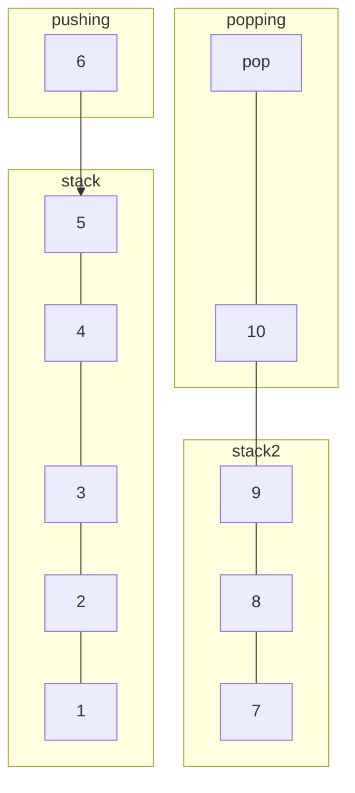

# Stack
Stack is an [Abstract Data Type](./CS50x_Abstract-Data-Type.md), that describes a collection of elements organized in sequence and added/removed from only one end
The name is an analogy to a set of physical elements stacked on top of each other

## Operations
A Stack has 3 different operations allowed to it: 
- **Push**: Adds an element to the stack
- **Pop**: Removes the most recent element added to the stack
- **Peek**: Gives the value of the last element added to the stack

## Behavior
The behavior of a stack is described as Last In, First Out, or the acronym LIFO. The same way as a physical stack of objects, the last added element must be removed first to access the ones added before.

