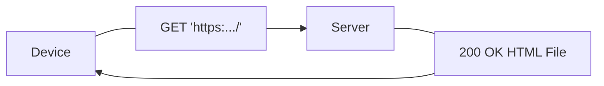
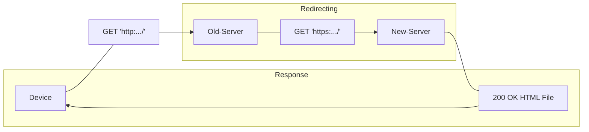

# HTTP Response
A HTTP Response is a message returned from a server after a [HTTP Request](./CS50x_HTTP-Request.md) method is executed.  
A common response consists mainly of a *status code*, and, possibly a file returned from the server



## Examples
This is a response returned when acessing `https://www.example.com`

```http
HTTP/1.1 200 OK
Content-Encoding: gzip
Accept-Ranges: bytes
Age: 425623
Cache-Control: max-age=604800
Content-Type: text/html; charset=UTF-8
Date: Tue, 31 Oct 2023 23:19:38 GMT
Etag: "3147526947"
Expires: Tue, 07 Nov 2023 23:19:38 GMT
Last-Modified: Thu, 17 Oct 2019 07:18:26 GMT
Server: ECS (bsb/27E0)
X-Cache: HIT
Content-Length: 648
```

The main part is:
- `HTTP/1.1 200 OK`
    - The version of HTTP being used
    - The status code returned after trying to access the website. In this case `200 OK`
- `Content-Type: text/html; charset=UTF-8`
    - The type of file returned from the server
    - The character encoding used in that file

### Insecure version responses
The response differs a bit when trying to access a website with `http` instead of `https`

```http
HTTP/1.1 301 Moved Permanently
Connection: close
Content-Length: 0
Server: Varnish
Retry-After: 0
Location: https://www.harvard.edu/
Accept-Ranges: bytes
Date: Tue, 31 Oct 2023 23:27:46 GMT
Via: 1.1 varnish
X-Served-By: cache-ewr18174-EWR
X-Cache: HIT
X-Cache-Hits: 0
Strict-Transport-Security: max-age=300
```
In this case, `harvard.edu `sends: 
- `301 Moved Permanently` 
    - A response that means the website address changed

- `Location: http`
    - A redirect URL to the secure version with `https`


## Response types
Some response codes: 

| Status Code    | Meaning| Description|
|---------------- | --------------- | --------------- |
| 200        | OK         | The request was succesful |
| 301        | Moved Permanently | The URL has changed permanently, the new URL is in the response    |
| 401       | Unauthorized |Must login first before performing an action|
| 403 | Forbidden | User does not have access rights to the content
| 404 | Not Found | Page does not exist



