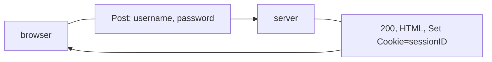
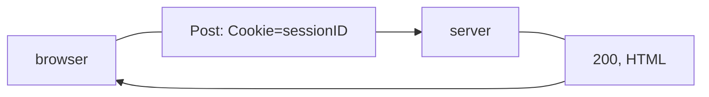

# HTTP Cookie
An HTTP cookie is some data from a server stored in a browser and is later resent to the server confirming that the requests are being sent from a user that has accessed that website previously.

Cookies are used for 3 purposes, mainly:

- Sessions Management
    - logins ids, shopping carts etc
- Personalization
    - Website themes and other settings
- Tracking
    - Analyzing user behavior

Cookies are essential to prevent the user from having to repeat actions again and again, like logging in multiple times a day or changing the website theme

## Example
A cookie is set by the server on the client's web browser through the [HTTP Response](../Week-8-HTML-CSS-JS/CS50x_HTTP-Response.md). Like when logging in
```python
resp = make_response(redirect('/'))
resp.set_cookie('sessionID', id)
```

```http
HTTP/2.0 200 OK
Content-Type: text/html
Set-Cookie: sessionID=id
```

Next time a [HTTP Request](../Week-8-HTML-CSS-JS/CS50x_HTTP-Request.md) is sent the web browser sends

```http
GET / HTTP/2.0
Host: example.com
Cookie: sessionID=id
```


### First login


### Subsequent logins



