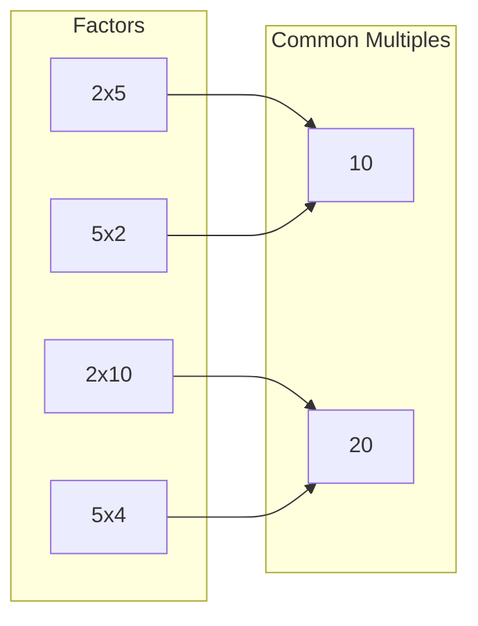

# Common Multiples
[Multiples](./Eyntam_Multiples.md) of two or more factors are called *Common Multiples*

```mermaid
flowchart LR
subgraph Factors
2x5 
2x10
5x2 
5x4
end

subgraph Common Multiples
2x5 --> 10
2x10 --> 20
5x2 --> 10
5x4 --> 20
end
```

$10$ and $20$ are common multiples of $2, 5, 10$ and  $4$
