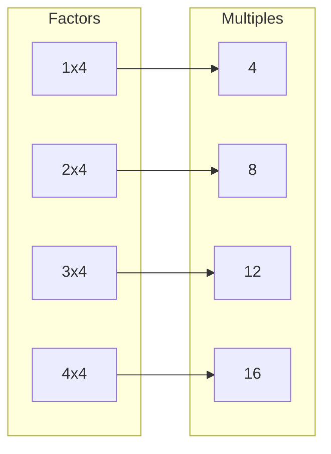

# Multiples
- Result of a multiplication of two [Whole Numbers](./Eyntam_Whole-Numbers.md)
    - The numbers that result in a multiple are [Factors](./Eyntam_Factors.md) of that number

```mermaid
flowchart LR
subgraph Factors
1x4  
2x4  
3x4  
4x4  
end

subgraph Multiples
1x4 --> 4
2x4 --> 8
3x4 --> 12
4x4 --> 16
end
```
