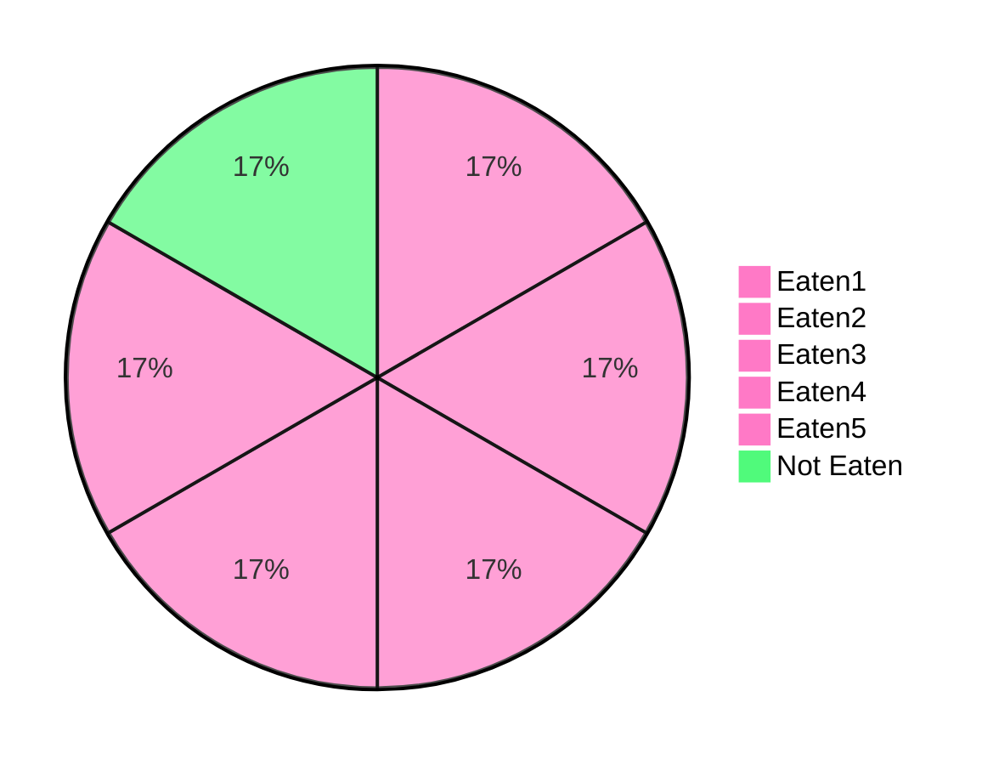

# Proper Fractions

A [Fraction](./Eyntam_Fractions.md) which the **numerator is smaller than the denominator**

## Example

A pizza was cut in 6 pieces. 5 were eaten  
As a fraction that is: $$\frac{5}{6}$$  

